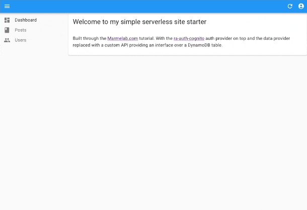

# A simple serverless webapp
Most projects I want to start need a CRUD setup and rather than building one every time i've tried to create a simple base to start from...

My initial forey in to learning react started with this tutorial from Marmelab.com: https://marmelab.com/react-admin/Tutorial.html and then adding the ra-auth-cognito auth provider ontop.

Everything is configured in a way that it should just slot in to a really basic CI/CD workflow with minimal fuss, the starting point is a makefile which allows single commands to run most of what you'd need to get started. 
Full instructions in the README.md for the repo.

A basic CRUD webapp deployed using Terraform template;
Its a simple React admin pannel frontend with an API backend and DynamoDB data store supported by Cognito euthentication

https://marmelab.com/react-admin/Tutorial.html

## Auth notes
1. Create a user in the cognito pool
2. Set the password for the new user like
`aws cognito-idp admin-set-user-password \
     --user-pool-id ${userPoolId} \
     --username "${username}" \
     --password "${password}" \
     --permanent`

## Manally calling the API, without going through the FE
3. Generate your Bearer Token
   1. Manually
      1. Get the Bearer token
      `curl --location --request POST 'https://cognito-idp.${aws_region}.amazonaws.com' \
      --header 'X-Amz-Target: AWSCognitoIdentityProviderService.InitiateAuth' \
      --header 'Content-Type: application/x-amz-json-1.1' \
      --data-raw '{
         "AuthParameters" : {
            "USERNAME" : "${user created in step 1}",
            "PASSWORD" : "${user created in step 1}",
         },
         "AuthFlow" : "USER_PASSWORD_AUTH",
         "ClientId" : "${terraform output cognito_user_pool_id}"
      }'`

   2. Easy option
      1. Use the script in this repo to do this like:
      `./src/scripts/cognito/cognito_bearer.sh "31rncta0qp031229ah4kled3th" "USERNAME" "PASSWORD" | jq -r '.AuthenticationResult.AccessToken'`

2. Call the API
curl --request GET 'https://${Terraform frontend_cdn.cname}/api/${endpoint}' --header 'Authorization: Bearer ${Bearer Token}'

